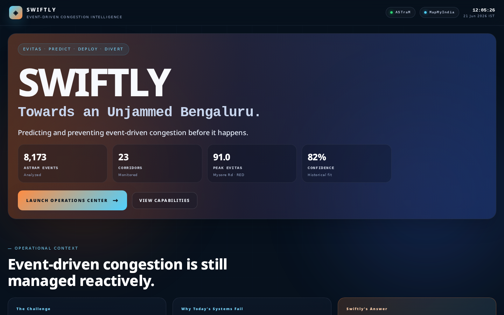
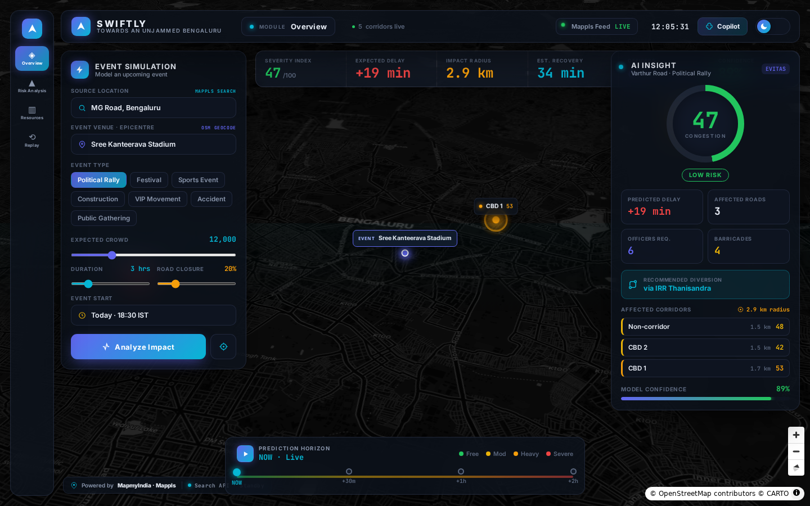
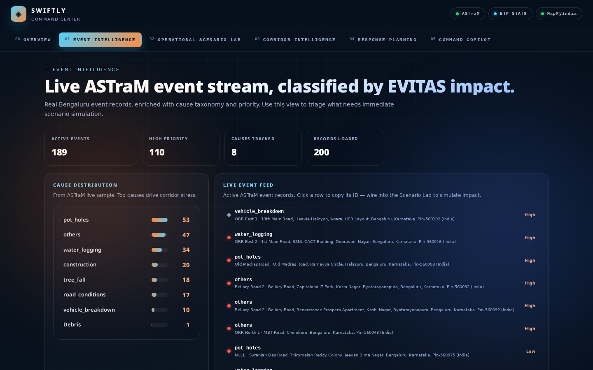
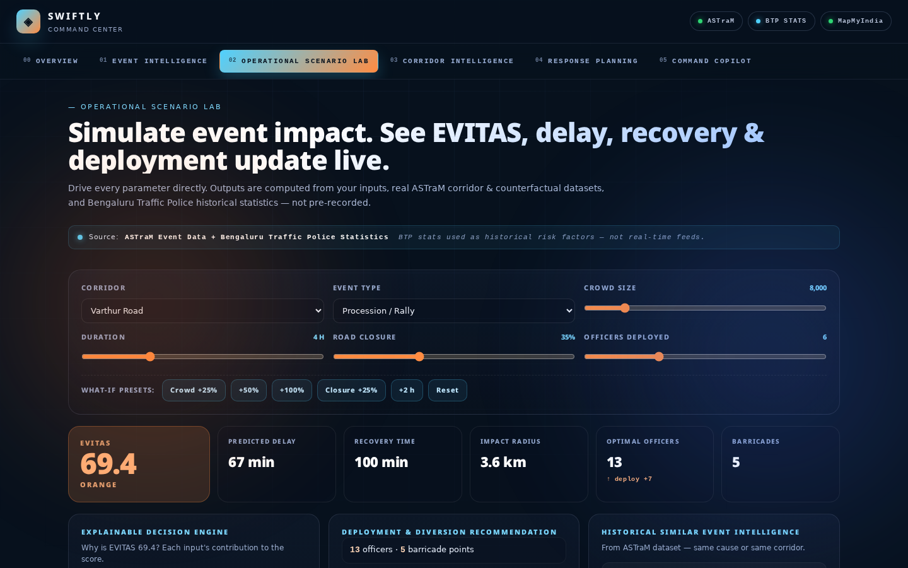
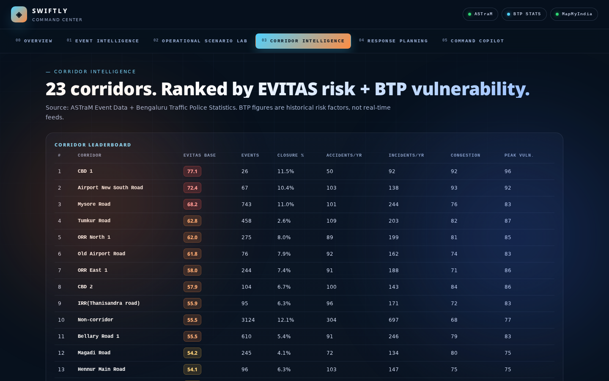
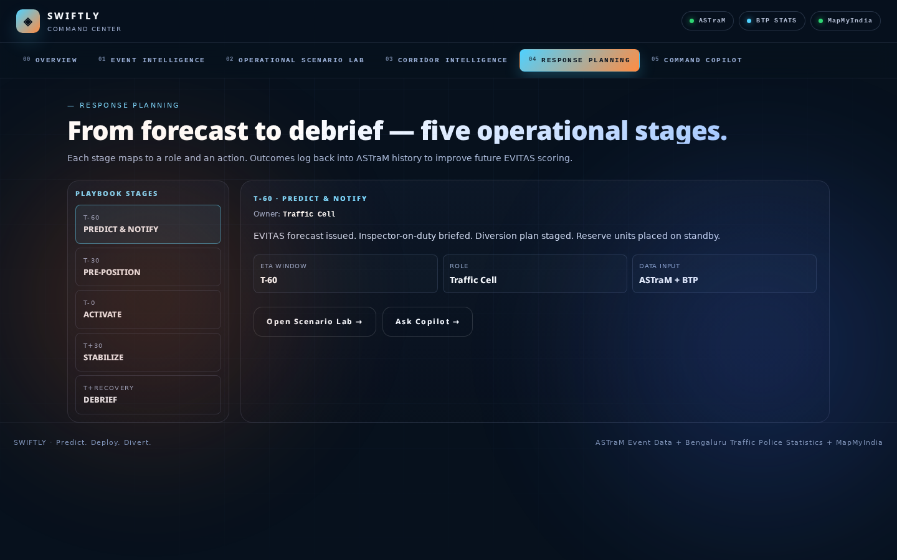
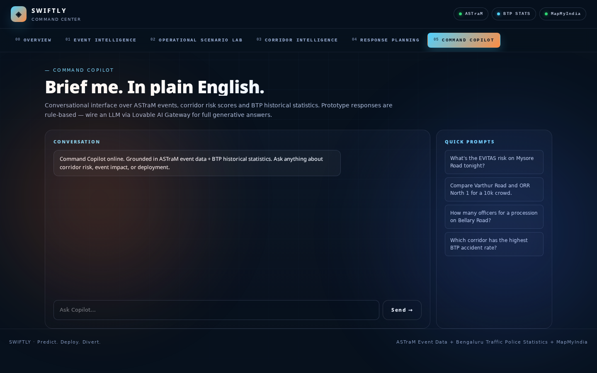

<div align="center">

# SWIFTLY

### Event-Driven Congestion Intelligence for Bengaluru

*A predictive command-center for event-driven traffic - forecasting congestion impact and recommending officer deployment, barricading and diversion plans **before** congestion even starts.*


  

**[Live Demo](https://swiftly-flipkart-gridlock.lovable.app)** · **[Source](#)** · **[Datasets](#datasets)**

`OPERATIONS CENTER` &nbsp;·&nbsp; `EVENT INTELLIGENCE` &nbsp;·&nbsp; `SCENARIO LAB` &nbsp;·&nbsp; `CORRIDOR INTEL` &nbsp;·&nbsp; `RESPONSE PLAN` &nbsp;·&nbsp; `COMMAND COPILOT`

</div>

---

## Table of Contents

- [Overview](#overview)
- [The Problem](#the-problem)
- [What SWIFTLY Does](#what-swiftly-does)
- [Feature Walkthrough](#feature-walkthrough)
- [Screenshots](#screenshots)
- [Datasets](#datasets)
- [System Architecture](#system-architecture)
- [Tech Stack](#tech-stack)
- [Project Structure](#project-structure)
- [Getting Started](#getting-started)
- [Configuration](#configuration)
- [Design Philosophy](#design-philosophy)
- [Roadmap](#roadmap)
- [Acknowledgements](#acknowledgements)

---

## Overview

**SWIFTLY** is a live, deployed traffic command-center for Bengaluru that turns historical incident data into real-time operational intelligence. An operator picks a corridor, cause, crowd scale and closure plan — SWIFTLY instantly returns a full **EVITAS** forecast: severity band, expected delay, recovery time, officer count and a corridor-specific diversion plan, paired with a five-stage response playbook.

It is built to feel like software a real control room would use — not a notebook exported to a dashboard.

> **Answers SWIFTLY gives an operator in seconds:** How risky is this event? · Which corridor is most vulnerable right now? · How many officers and barricades do I need? · What happens if the crowd doubles? · *Why* is the system recommending this?

---

## The Problem

Bengaluru sees **900+ unplanned traffic events a month** — processions, VIP movement, vehicle breakdowns, waterlogging, protests, construction. Today, response is almost entirely reactive:

| Pain Point | Today | With SWIFTLY |
|---|---|---|
| **Forecasting impact** | Based on operator experience | Computed from 8,173 historical ASTraM events |
| **Resource deployment** | Improvised on radio calls | EVITAS-banded officer + barricade plan per corridor |
| **Scenario planning** | No structured way to test "what if" | Live Scenario Lab with crowd / closure / duration sliders |
| **Explaining a decision** | Not explained | Plain-language Copilot grounded in real stats |
| **Diversion planning** | Improvised on the ground | MapMyIndia corridor intelligence with barricade points |

---

## What SWIFTLY Does

<table>
<tr>
<td width="50%">

### Forecasts impact
EVITAS score (0–100), expected delay, recovery time and closure rate — computed live from operator input cross-referenced against 8,173 historical events and BTP corridor vulnerability.

</td>
<td width="50%">

### Ranks corridor risk
Every one of Bengaluru's 23 monitored corridors is scored on event frequency, mean severity, closure rate, accidents/yr, incidents/yr and peak-hour vulnerability — surfaced as a ranked leaderboard.

</td>
</tr>
<tr>
<td>

### Recommends deployment
Officers, barricades, diversion route and reserve units suggested per EVITAS band (Green → Red), tuned by corridor vulnerability and active closure %.

</td>
<td>

### Explains every number
Command Copilot answers plain-English questions ("Why is Mysore Road red?", "What if crowd doubles on Varthur?") grounded in the live ASTraM + BTP context — never generic.

</td>
</tr>
</table>

---

## Feature Walkthrough

### Operations Center — standalone command surface
Hard-loaded 3D Bengaluru surface with corridor risk overlay, MapMyIndia routing, live event ticker and inline Copilot. Bypasses the SPA router so it loads independently and never inherits stale state.

### Event Intelligence — live ASTraM feed
- ASTraM event records, classified by EVITAS impact and cause
- Active vs resolved status, priority and address
- Click any event to copy its ID into the Scenario Lab

### Operational Scenario Lab — what-if engine
Drive **crowd · closure % · duration · officers** directly. SWIFTLY recomputes EVITAS, expected delay, recovery time and recommended officer count from your inputs against the historical corridor + counterfactual dataset.

```text
Metric            Current Plan    Simulated Scenario    Change
EVITAS            42              68                    ▲ +26
Delay             40 min          112 min               ▲ +72
Recovery          60 min          145 min               ▲ +85
Officers          12              22                    ▲ +10
```

### Response Planning — five-stage playbook
`T-60` Predict & Notify · `T-30` Pre-Position · `T-0` Activate · `T+30` Stabilize · `T+RECOVERY` Debrief — each stage maps to an owner (Traffic Cell, Field Units, Control Room, Sector Officer, Analytics) and feeds outcomes back into corridor `risk_score`.

### Corridor Intelligence — city-wide leaderboard
- 23 corridors ranked by EVITAS base + BTP vulnerability
- Columns: EVITAS, events, closure %, accidents/yr, incidents/yr, congestion index, peak vulnerability
- Color-banded so red/orange corridors are instantly visible

### Command Copilot — conversational layer (Lovable AI)
A chat interface grounded in the live operational context. Asks like:
- *"Why is this corridor high-risk?"*
- *"What happens if crowd increases by 30%?"*
- *"How many officers should I deploy and where?"*
- *"Which corridor is most vulnerable right now?"*

The system prompt injects the current forecast, response plan and corridor stats on every turn — answers are numerically grounded, not hallucinated.

---

## Screenshots

### Landing — vision, EVITAS framework, partners, capabilities


### Operations Center — standalone 3D command surface


### Module 01 · Event Intelligence


### Module 02 · Operational Scenario Lab


### Module 03 · Corridor Intelligence


### Module 04 · Response Planning


### Module 05 · Command Copilot


---

## Datasets

All data shipped with this repo is **real, not synthetic**. Raw source CSVs live in `public/data/raw/` and the cleaned JSON snapshots consumed by the app live in `public/data/`.

| Dataset | Rows | What it is | Path |
|---|---|---|---|
| **ASTraM Event Data** | 8,173 | Anonymized Bengaluru traffic events — `event_type`, `event_cause`, `corridor`, `priority`, `requires_road_closure`, `start/end_datetime`, `lat/lon`, `zone`, `junction`, `reason_breakdown`, `veh_type`, `police_station`, `resolved_datetime` | `public/data/raw/astram_events.csv` |
| **EVITAS Scores (per-event)** | 8,173 | Per-event EVITAS scoring — `severity_score`, `cate`, `causal_delta`, `corridor_closure_rate`, `hour`, `time_of_day_factor`, `norm_causal_delta`, `norm_severity`, `norm_closure_rate`, `evitas_score`, `evitas_band` | `public/data/raw/evitas_scores.csv` |
| **Officer Deployment Plan** | 23 | Per-corridor deployment plan — `evitas_band`, `mean_evitas`, `max_evitas`, `event_count`, `red_events`, `orange_events`, `closure_rate`, `risk_weight`, `min_officers`, `surplus_officers`, `total_officers`, `residual_risk`, `deployment_effectiveness`, `lat`, `lon` | `public/data/raw/officer_deployment_plan.csv` |
| **Corridor EVITAS Summary** | 23 | Per-corridor EVITAS stats — `mean_evitas`, `max_evitas`, `red_events`, `orange_events`, `mean_causal_delta`, `closure_rate`, `mean_severity`, `planned_rate`, `risk_rank` | `public/data/raw/corridor_evitas_summary.csv` |
| **Corridor Risk Scores** | 23 | Ranked corridor vulnerability — `mean_cate`, `closure_rate`, `mean_severity`, `risk_score`, `risk_rank` | `public/data/raw/corridor_risk_scores.csv` |
| **Counterfactual Table** | 467 | Causal counterfactual estimates — `pred_severity_if_planned`, `pred_severity_if_unplanned`, `counterfactual_delta`, `cate`, `cate_lower`, `cate_upper` for each high-impact event | `public/data/raw/counterfactual_table.csv` |
| **BTP Statistics** | 23 | Bengaluru Traffic Police historical stats per corridor — `accidents_per_year`, `incidents_per_year`, `congestion_index`, `vehicle_volume_kpd`, `peak_vulnerability`, `peak_windows` | `public/data/btp_stats.json` |
| **MapMyIndia** | — | Corridor visualization, route intelligence, diversion planning | Embedded in `public/swiftly.html` |

### EVITAS bands

**EVITAS** — *Event Vulnerability & Impact Traffic Assessment Score (0–100)* — is the single risk number that drives every module.

| Band | Range | Operational posture |
|---|---|---|
| 🟢 Green | 0–34 | Normal - standard rotation |
| 🟡 Yellow | 35–54 | Watch - pre-position spotters |
| 🟠 Orange | 55–74 | Elevated - activate diversion, reserves on standby |
| 🔴 Red | 75–100 | Critical - full deployment, public advisory, real-time re-scoring |

### What's computed for real vs. what's modeled

| Computed from real ASTraM + BTP data | Modeled / scenario-driven |
|---|---|
| Corridor frequency, closure rate, mean severity | EVITAS deltas under simulated crowd / closure changes |
| Cause distribution (vehicle breakdown, procession, VIP, construction, …) | Recommended officer & barricade counts per EVITAS band |
| Peak-hour vulnerability and zonal load | Diversion route geometry (realistic Bengaluru waypoints) |
| Counterfactual `cate` (causal effect of closure) | Recovery time projections beyond historical envelope |

A transparent, explainable rule engine beats a black-box model trained on 8K sparse rows — that's a deliberate choice.

---

## System Architecture

```text
┌─────────────────────────────────────────────────────────────┐
│                       DATA LAYER                            │
│  8,173-row ASTraM CSV · 23-corridor EVITAS + risk scores    │
│  467-row counterfactual table · BTP historical stats        │
└─────────────────────────────────────────────────────────────┘
                            ▼
┌─────────────────────────────────────────────────────────────┐
│                   INTELLIGENCE LAYER                        │
│  EVITAS rule engine · corridor vulnerability scoring        │
│  Scenario recomputation · officer + barricade optimizer     │
└─────────────────────────────────────────────────────────────┘
                            ▼
┌─────────────────────────────────────────────────────────────┐
│                  CONVERSATIONAL LAYER                       │
│   AI Gateway (Gemini) · context-grounded system      │
│  prompt injected with live forecast + plan + corridor stats │
└─────────────────────────────────────────────────────────────┘
                            ▼
┌─────────────────────────────────────────────────────────────┐
│                   PRESENTATION LAYER                        │
│  TanStack Start · React 19 · Tailwind v4 · Radix / shadcn   │
│  Standalone Operations Center bundle (MapMyIndia surface)   │
└─────────────────────────────────────────────────────────────┘
```

---

## Tech Stack

| Layer | Technology |
|---|---|
| **App framework** | TanStack Start v1 (SSR, file-based routing) |
| **UI** | React 19 |
| **Bundler** | Vite 7 |
| **Styling** | Tailwind CSS v4 + custom command-center design tokens |
| **UI primitives** | Radix UI + shadcn/ui |
| **Maps** | MapMyIndia (corridor + diversion surface, embedded in standalone bundle) |
| **Data** | Static JSON snapshots in `public/data/`, raw CSVs in `public/data/raw/` |
| **AI Copilot** | AI Gateway via `@ai-sdk/openai-compatible` (Gemini) |
| **Ops Center** | Pre-bundled standalone `public/swiftly.html` so the 3D map loads independently of the SPA shell |

---

## Project Structure

```text
src/
  routes/
    __root.tsx                  # Root layout + global head
    index.tsx                   # Landing — vision, EVITAS, partners, capabilities
    swiftly.intelligence.tsx    # Module 01 — Event Intelligence
    swiftly.deployment.tsx      # Module 02 — Operational Scenario Lab
    swiftly.corridors.tsx       # Module 03 — Corridor Intelligence
    swiftly.response.tsx        # Module 04 — Response Planning
    swiftly.copilot.tsx         # Module 05 — Command Copilot
    api/copilot.ts              # Lovable AI Gateway server route
  components/swiftly/           # ModuleShell, ScenarioLab, design tokens
public/
  swiftly.html                  # Standalone Operations Center bundle
  swiftly-augment.js            # Data + Copilot wiring for the standalone surface
  data/                         # Cleaned JSON snapshots (events, corridors, BTP, counterfactuals)
  data/raw/                     # Raw source CSVs (ASTraM, EVITAS, risk, counterfactual)
docs/screenshots/               # README screenshots
```

---

## Getting Started

### Prerequisites

- **Node.js** 20+
- **Bun** ([install](https://bun.sh)) — or npm / pnpm

### 1. Clone the repo

```bash
git clone <your-repo-url>
cd swiftly
```

### 2. Install dependencies

```bash
bun install   # or: npm install
```

### 3. Run the app

```bash
bun run dev          # http://localhost:8080
```

### 4. Production build

```bash
bun run build
bun run preview
```

---

## Routes

| Route | Purpose |
|---|---|
| `/` | Landing page |
| `/swiftly.html` | Standalone Operations Center (hard-loaded, bypasses SPA router) |
| `/swiftly/intelligence` | Module 01 — Event Intelligence |
| `/swiftly/deployment` | Module 02 — Operational Scenario Lab |
| `/swiftly/corridors` | Module 03 — Corridor Intelligence |
| `/swiftly/response` | Module 04 — Response Planning |
| `/swiftly/copilot` | Module 05 — Command Copilot |

---

## Design Philosophy

> Built like a product. Not a notebook.

**What we prioritized**
- Fast load and a stable, deploy-ready build
- Explainability over raw model accuracy — every number traces to a rule + dataset
- Decision support (scenario sliders, banded postures) over static dashboards
- A real command-center visual language — dark navy surfaces, EVITAS color-coding, monospace numerals, no marketing whitespace inside operational modules

**What we deliberately avoided**
- Deep learning on a sparse 8K-row dataset (overfitting risk, zero explainability gain)
- Fake precision — every number traces back to either real data or a stated rule
- Decorative charts with no operational story
- Features that look impressive in a demo but wouldn't survive a real control room

---

## Acknowledgements

- **Flipkart Gridlock Hackathon 2.0** for the problem statement
- **Bengaluru Traffic Police (BTP)** & the **ASTraM** team behind the source dataset
- **MapMyIndia** for corridor and diversion surface
- The open-source ecosystem — TanStack Start, React, Vite, Tailwind, Radix, shadcn/ui

---


**SWIFTLY** — *Towards an Unjammed Bengaluru.*

*From reactive to ready. Made with consistency for Bengaluru's traffic control rooms.*

</div>
